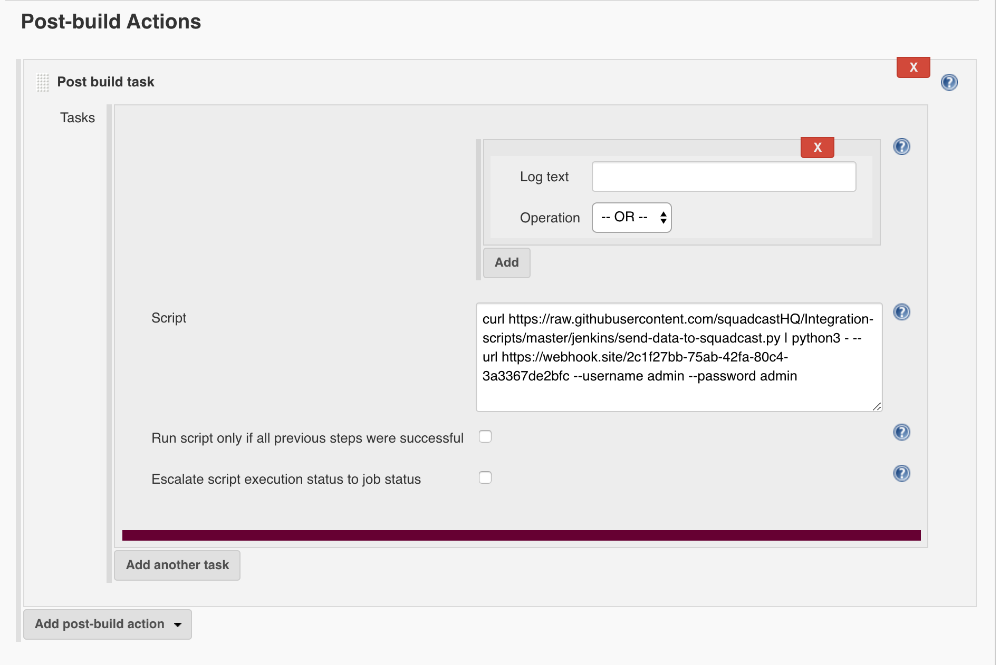
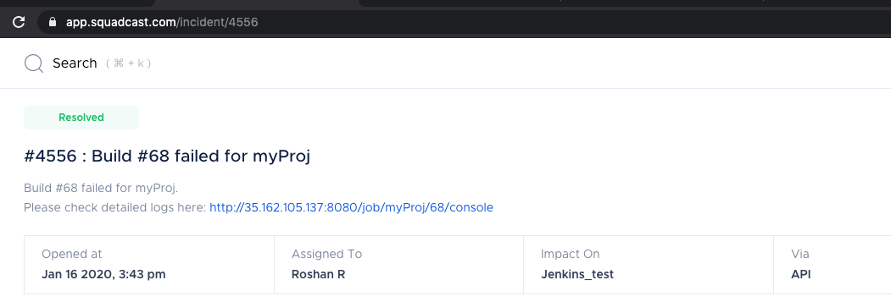

## Usage
+ Install [Post build task](https://wiki.jenkins.io/display/JENKINS/Post+build+task) plugin in Jenkins 
+ Create a user in Jenkins (This user will be used with curl command to fetch the jenkins job status)
+ Create an API endpoint in [Squadcast app](https://support.squadcast.com/docs/api)  
+ Add a `Post build task` and run the following command in `Script` text box
```sh
curl https://raw.githubusercontent.com/squadcastHQ/Integration-scripts/master/jenkins/send-data-to-squadcast.py | python3 - --url https://api.squadcast.com/v1/incidents/jenkins/c56a30a7a282321a53c5a94bb2085c24e721bc55 --username *yourusername* --password *enterpassword*
```

Please replace url(Squadcast API endpoint), username and password in the above command

__P.S: We highly recommend cloning this repo and using your repo link in the above curl call, This will allow you to customize your incident description__

### Sample incident created in Squadcast-App
